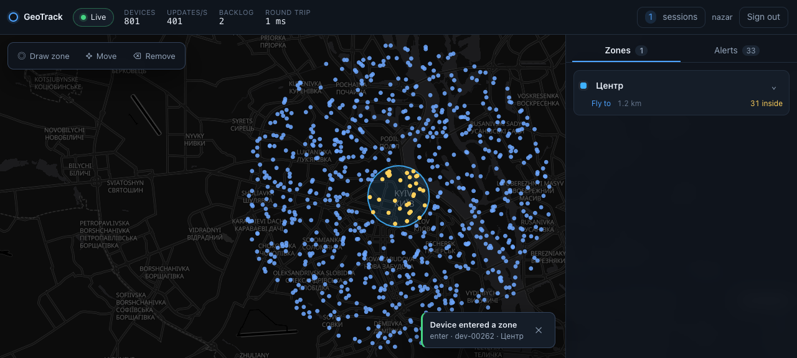
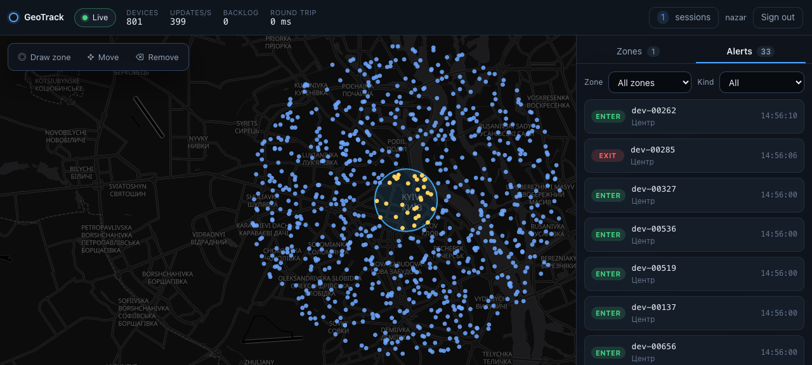
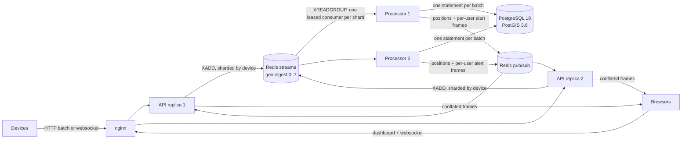
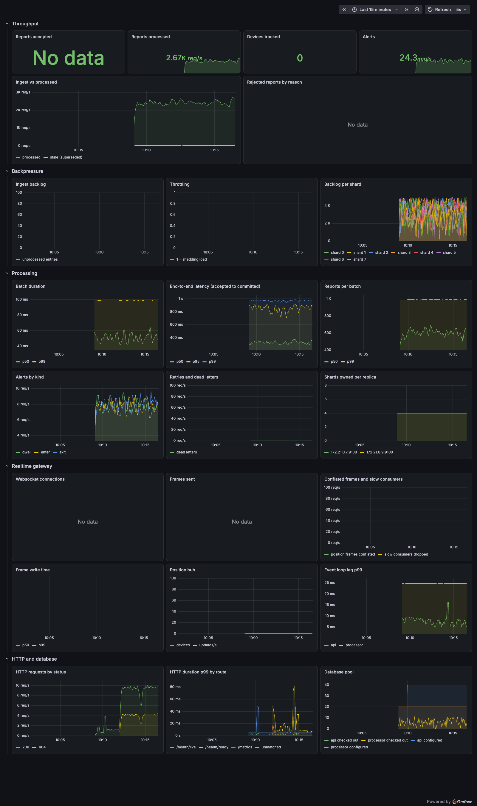

# GeoTrack

A backend service that ingests positions from a fleet of tracking devices, streams them to
browsers in real time, and alerts each user when a device crosses one of their geofences.
Devices report over HTTP or a websocket; the API validates and shards the reports into Redis
streams; leased processor replicas apply each batch to PostGIS in a single set-based
statement and publish the results; every dashboard session of the affected user receives the
alert, on whichever API replica it happens to be connected to.



## Contents

- [Quick start](#quick-start)
- [Running the load generator](#running-the-load-generator)
- [Architecture](#architecture)
- [Spatial queries](#spatial-queries)
- [WebSocket architecture](#websocket-architecture)
- [Throughput and backpressure](#throughput-and-backpressure)
- [Measured results](#measured-results)
- [API reference](#api-reference)
- [Configuration](#configuration)
- [Testing](#testing)
- [Security notes](#security-notes)
- [Trade-offs and next steps](#trade-offs-and-next-steps)

## Quick start

Requirements: Docker with Compose v2 and roughly 4 GB free for the containers. Python,
PostgreSQL and Redis all live inside the stack, so nothing else needs installing.

```bash
git clone <repository-url> geotrack && cd geotrack
make up            # generates .env with random secrets, builds, waits for health
open http://localhost:8080
```

`make up` is equivalent to `./scripts/bootstrap-env.sh && docker compose up -d --wait`, so a
plain `docker compose` workflow works too once `.env` exists.

Sign in with any username; authentication is intentionally mocked (see
[Security notes](#security-notes)). Open the same username in a second browser, or on a phone on
the same network, to watch alerts and zone edits arrive in both places at once.

| What | Where |
|---|---|
| Dashboard | <http://localhost:8080> |
| OpenAPI docs | <http://localhost:8080/docs> |
| Prometheus metrics | `/metrics` on each API and processor container (not exposed publicly) |
| Grafana (optional) | `make up-monitoring`, then <http://localhost:3000> |

Useful targets: `make ps`, `make logs`, `make smoke` (drives login → zone → ingest → live
alert against the running stack), `make test`, `make down`, `make destroy`.

One trap worth knowing: the database keeps the password it was initialised with. If you delete
`.env` after a first run, the regenerated secrets will not match the existing volume and the
migration step fails with `password authentication failed`. `make destroy` drops the volumes and
starts clean.



## Running the load generator

`generator.py` simulates a fleet of devices that drift realistically. Each one keeps a heading
and a speed drawn from a movement profile, and turns or accelerates a little on every tick rather
than teleporting.

```bash
make load                                  # 10,000 devices inside the compose network
docker compose --profile loadtest run --rm generator --devices 10000 --interval 3 --duration 300
uv run generator.py --devices 500 --url http://localhost:8080 --ingest-key "$INGEST_API_KEY"
```

The script is standalone (PEP 723 inline dependencies), so `uv run generator.py` works outside
the project environment as well. Run it **inside the compose network** for anything above a few
hundred devices: Docker Desktop's port forwarding, the host's ephemeral port range and its
listen backlog all become the bottleneck long before the service does.

Key flags: `--transport ws|http`, `--devices`, `--interval` (mean seconds between reports,
jittered ±20%), `--connections`, `--batch-size`, `--center lat,lon`, `--radius-km`, `--duration`,
`--ramp-up`, `--seed`, `--json-summary PATH`. Every flag also reads an environment variable, which
is how the compose service is configured.

While it runs it prints one line per interval with offered and accepted rates, drops, throttles,
reconnects and acknowledgement latency percentiles. It ends with a summary that `--json-summary`
also writes as JSON.

## Architecture



Each part has one job:

- **nginx** terminates the public port, serves the dashboard, proxies REST and websockets, and
  rate-limits logins. It is the only container that publishes a port.
- **API replicas** are stateless. They authenticate, validate reports, shard them by
  `crc32(device_id) % INGEST_SHARDS` and append them to Redis streams; they also host the
  realtime gateway that owns the browser websockets.
- **Redis** is the queue (streams, one per shard) and the fan-out bus (pub/sub, one channel for
  positions and one per user for alerts, zone changes and session lists).
- **Processor replicas** lease shards, read batches, apply them to PostGIS in one statement and
  publish the results. Shard leases are what keeps the work split and self-healing.
- **PostgreSQL + PostGIS** holds users, zones, the latest position of every device, geofence
  presence, alerts and a day-partitioned history table.

## Spatial queries

Zone centres and device positions are `geography(Point,4326)`. Geography keeps distances in
metres on the WGS84 spheroid anywhere on Earth, which is what a geofence in metres needs;
geometry would force a projection choice and degree-based approximations.

**The problem.** The natural way to match a batch of points against zones does not use an index:

```sql
JOIN geozones z ON ST_DWithin(z.center, b.position, z.radius_m)
```

The search distance comes from the indexed table itself, so PostGIS cannot turn it into an index
condition. Measured on 1,000 points against 10,000 zones: **5.9 s**, a sequential scan per point.

**The fix.** Each zone stores a generated column that circumscribes it, indexed with GiST:

```sql
search_area geography(Polygon,4326)
    GENERATED ALWAYS AS (ST_Buffer(center, radius_m * 1.02 + 1.0, 'quad_segs=8')) STORED
```

and every query filters with the index first and decides with the exact predicate:

```sql
WHERE z.search_area && b.position          -- GiST index scan, cheap and approximate
  AND ST_DWithin(z.center, b.position, z.radius_m)   -- exact, on the spheroid
```

Same workload: **87 ms**, identical results, about 65× faster. `ST_Buffer` returns an inscribed
32-gon, so the 2% + 1 m padding is what guarantees the polygon contains the true circle; the
suite proves it over 312,000 boundary probes (radius ± 1 mm at 72 azimuths, from the equator to
±84° latitude and across the antimeridian) and asserts that the query plan really is an index
scan, so a regression in either cannot pass silently.

The reverse question, which devices are inside a given zone, uses the same index from the other
side, on `device_positions`, with the radius as a constant.

**Alert semantics.** Presence is server-side state in `zone_presence`, so alerts describe
transitions rather than repeating for every report: `enter` when a device crosses in (including
the first report after a zone is created around it), `exit` when it leaves, and an optional
`dwell` reminder every `dwell_alert_interval_s` while it stays. Enter and exit can be switched
off per zone.

One statement per batch does all of it inside a single transaction: upsert the latest positions
(ignoring reports older than what is stored), find the zone hits, diff them against the previous
presence, write the transitions, insert the alerts and return both the accepted positions and the
new alerts. Replaying the same batch produces no duplicate alerts, which is what makes
at-least-once delivery from Redis safe.

## WebSocket architecture

**Connections.** Browsers connect to `/ws` with the token in a subprotocol
(`["geotrack.v1", "bearer.<jwt>"]`) or, for command-line tools, `?access_token=`. Devices use
`/ws/ingest` with the ingest key. No database connection is ever held for the lifetime of a
socket, because that would exhaust the pool at a few hundred clients.

**State.** Each replica keeps a registry of connections per user and a position hub holding the
latest position of every device, bucketed into a grid of cells. A replica subscribes to a user's
Redis channel when that user's first session arrives and unsubscribes when the last one leaves, so
fan-out work only lands where it is needed. Sessions are also registered in Redis, which is how
the dashboard can show every active session of the same user across replicas.

**Broadcasting.** A tick loop (default 250 ms) serialises each changed cell **once** and hands the
same bytes to every connection whose viewport covers that cell. Producers never await a socket:
they enqueue, and one sender task per connection does the writing.

**Backpressure towards clients.** A connection holds at most one pending position frame. If a
client has not drained it by the next tick, the frame is dropped and the connection is marked for
a snapshot instead, so a slow client receives the current truth rather than a growing queue of
stale deltas. Alerts and zone events use a bounded queue; if that overflows, the connection is
closed with 1013 and the dashboard reconnects and backfills the gap over REST. Every send is
wrapped in a timeout, so one stuck socket cannot pin a task forever.

**Multi-session routing.** Because alerts travel through Redis rather than in-process, a user with
a laptop on replica A and a phone on replica B receives every alert on both, and a zone edited on
one appears instantly on the other. The suite proves this with two real servers sharing one Redis,
and the same scenario was driven by hand against the running stack.

## Throughput and backpressure

- **Ordering.** Reports are sharded by device, and each shard has exactly one consumer at a time,
  so one device's reports are always applied in order. Out-of-order or duplicated reports are
  ignored by a timestamp guard in the upsert.
- **Leases.** A processor holds a shard through a Redis lease it renews continuously. If it dies,
  the lease expires and another replica takes the shard over, re-reading whatever the previous
  owner had read but not acknowledged. A per-shard advisory lock keeps the handover safe.
- **Batching.** Consumers read up to `PROCESSOR_BATCH_SIZE` entries per round and apply them in
  one statement, so the batch grows automatically when load rises: measured at one report per
  batch when idle and 250 under overload.
- **Acknowledgement.** Entries are acknowledged only after the transaction commits (with
  `XACKDEL`, so the stream holds exactly the unprocessed backlog). A crash before the
  acknowledgement replays the batch, which is harmless because the statement is idempotent.
- **Backpressure.** A monitor polls the backlog and flips a gate at `INGEST_BACKLOG_HIGH`, back
  at `INGEST_BACKLOG_LOW`. While the gate is shut, HTTP ingestion answers `503` with `Retry-After`
  before reading the body, and websocket devices are told to hold off. Frames shed this way are
  counted; the queue never grows unbounded, and Redis is configured `noeviction` so it refuses
  writes rather than silently dropping a stream.
- **Connection pools.** Pools are bounded with no overflow and a short timeout; exhaustion becomes
  an immediate `503` instead of a pile-up. The arithmetic is deliberate: 2 API replicas × 10 +
  2 processors × (8 shards + 2) + migrations ≈ 41 connections against `max_connections=200`.
- **Event loop.** Spatial work happens in PostGIS, JSON parsing goes through pydantic-core, and
  both services measure their own event loop lag (`geotrack_event_loop_lag_seconds`) so the claim
  is checked rather than asserted.

## Measured results

Measured on a laptop (Docker Desktop, 15 CPUs, 7.6 GB for the VM) with the full stack running:
nginx, 2 API replicas, 2 processors, PostgreSQL and Redis, plus the generator inside the same
network. Zones: 25. Details in [docs/load-test.md](docs/load-test.md).

**Steady state: 10,000 devices, one report every 3 s, 5 minutes**

| Metric | Result |
|---|---|
| Reports accepted | 949,583 (3,164/s), zero rejected, dropped or failed |
| Ingestion acknowledgement | p50 4.4 ms, p95 6.0 ms, p99 8.3 ms |
| Ingest → committed in PostGIS | p50 25 ms, p99 25 ms |
| Batch apply time | p50 5 ms, p99 10 ms |
| Backlog | 0 for the whole run |
| Event loop lag (both services) | p50 1 ms, p99 10 ms |
| Stale reports / retries / dead letters | 0 / 0 / 0 |
| Memory | API 127 MB each, processor 76 MB each, PostgreSQL 433 MB, Redis 14 MB |

**Deliberate overload: the same fleet reporting 15× faster, watermarks lowered to 4,000/1,500**

| Metric | Result |
|---|---|
| Offered | 39,705 reports/s |
| Accepted | 27,471 reports/s sustained |
| Shed | 2,318 throttle responses; the generator dropped what it could not send |
| Errors | 0 transport failures, 0 dead letters, 0 retries |
| Under load | batch p99 25 ms, ingest → commit p99 250 ms, batch size p99 250 reports |
| After load | backlog back to 0 and the gate reopened within seconds |

The service sheds load deliberately instead of collapsing: the queue stays bounded, devices are
told when to back off, and nothing that was accepted is lost.



## API reference

All endpoints live under `/api/v1` and answer errors as `application/problem+json` with a stable
`code`. Full schemas are at `/docs`.

| Method | Path | Purpose |
|---|---|---|
| POST | `/auth/login` | Exchange a username for a bearer token (mock auth) |
| GET | `/auth/me` | Identity behind the token |
| GET/POST | `/geozones` | List or create zones (per-user, quota enforced) |
| GET/PUT/PATCH/DELETE | `/geozones/{id}` | Read, replace, update or delete; `If-Match` supported |
| GET | `/geozones/presence` | Devices currently inside each of the caller's zones |
| GET | `/geozones/{id}/devices` | Devices inside one zone right now |
| GET | `/alerts` | Alert history, keyset pagination, filters by zone and kind |
| GET | `/devices` | Latest positions, filtered by bounding box |
| GET | `/devices/{id}`, `/devices/{id}/track` | One device now, or its recent track |
| POST | `/ingest/locations` | Submit one report, an array, or `{"seq": n, "items": [...]}` |

A zone of another user answers `404`, not `403`: existence is not leaked.

**WebSocket `/ws`.** Server frames: `hello`, `positions` (compact arrays, `full` marks a
snapshot), `alert` (the same shape the REST history returns), `zone` (created/updated/deleted),
`sessions`, `stats`, `error`. Client frames: `viewport` (the map's bounding box) and `ping`.

**WebSocket `/ws/ingest`.** Devices send one report, an array, or `{"seq": n, "items": [...]}`.
The server answers `ack` when a `seq` was given, `error` for a bad payload, and `throttle` while
shedding load.

## Configuration

Everything is environment-driven; `.env.example` documents every variable and
`./scripts/bootstrap-env.sh` (run by `make up`) fills the secrets with random values.

| Group | Variables |
|---|---|
| Secrets | `POSTGRES_PASSWORD`, `REDIS_PASSWORD`, `JWT_SECRET`, `INGEST_API_KEY`, `GRAFANA_ADMIN_PASSWORD` |
| Topology | `HTTP_PORT`, `POSTGRES_USER`, `POSTGRES_DB`, `GRAFANA_PORT` |
| Ingestion | `INGEST_SHARDS`, `INGEST_MAX_BATCH`, `INGEST_BACKLOG_HIGH`, `INGEST_BACKLOG_LOW`, `INGEST_MAX_FUTURE_SKEW_S` |
| Storage | `DB_POOL_SIZE`, `DB_POOL_TIMEOUT_S`, `DB_STATEMENT_TIMEOUT_MS`, `HISTORY_RETENTION_DAYS` |
| Processor | `PROCESSOR_BATCH_SIZE`, `PROCESSOR_BLOCK_MS`, `PROCESSOR_LEASE_TTL_MS` |
| Realtime | `WS_TICK_MS`, `WS_CONTROL_QUEUE_MAX`, `WS_SEND_TIMEOUT_S`, `WS_DEVICE_STALE_S`, `WS_GRID_CELL_DEG`, `WS_MAX_SESSIONS_PER_USER` |
| Load generator | `GENERATOR_*` (see `.env.example`) |

`INGEST_SHARDS` must be the same for every service; the first start records it in Redis and any
process that disagrees refuses to boot, because changing it silently would reorder a device's
reports.

## Testing

```bash
make test          # whole suite; starts throwaway PostGIS and Redis containers
make test-unit     # only the tests that need no infrastructure
make lint typecheck
```

689 tests. The integration tests run against a real PostgreSQL 18 + PostGIS 3.6 and a real Redis
8.10 through testcontainers (set `TEST_DATABASE_URL` / `TEST_REDIS_URL` to reuse running ones, as
CI does). They cover the spatial boundary behaviour and query plans, the batch state machine
including replays and concurrent zone deletion, shard leases and handover, the websocket
lifecycle over real sockets (slow consumers, throttling, keepalive), cross-replica fan-out with
two servers sharing one Redis, and the nginx and compose configuration itself.

CI runs the same gates on every push: lint, formatting, `mypy --strict`, the full suite with a
coverage floor, an image build, and a smoke run that boots the whole stack and drives login →
zone → ingest → live alert.

## Security notes

- **Authentication is mocked**, as the brief allows: a username is exchanged for a signed,
  expiring token, with no password. Everything downstream authorises against that token, so
  replacing this one module with a real identity provider is the whole change.
- Devices authenticate with a shared ingest key (`X-Ingest-Key`), compared in constant time.
- Every user-scoped query is filtered by the caller's id in SQL; cross-user access returns 404.
- Containers run as non-root with a read-only root filesystem, all capabilities dropped and
  `no-new-privileges`; only nginx publishes a port, and PostgreSQL and Redis sit on an internal
  network. Redis requires a password and refuses writes rather than evicting a stream.
- nginx sets a strict Content-Security-Policy (the dashboard's one inline import map is allowed
  by its hash, not by `unsafe-inline`), overwrites `X-Forwarded-For` with the real peer so it
  cannot be spoofed, and rate-limits logins.
- Secrets come from the environment and are generated per installation; none are committed.

## Trade-offs and next steps

- **Live delivery is at-most-once, history is durable.** If a replica cannot publish an alert, the
  alert is still in PostgreSQL and the dashboard backfills it over REST on reconnect. A
  transactional outbox would close the gap at the cost of another moving part.
- **Positions are fleet-wide.** The brief has no device ownership, so every user sees every
  device and zones are the per-user boundary. Tenant-scoped position streams would mostly mean
  partitioning the positions channel by tenant.
- **One Redis, one PostgreSQL.** Both are single points of failure here. The shapes that make them
  replaceable (leases, stateless replicas, idempotent batches) are already in place.
- **Next at higher scale:** PgBouncer in front of PostgreSQL, a binary frame format for positions,
  MQTT or gRPC ingestion for real trackers, TimescaleDB or a columnar store for history, and
  pushing viewport filtering into per-cell channels so a replica only receives what its clients
  can see.
